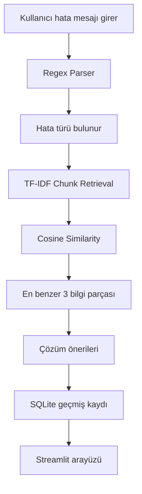

# AI Debug Assistant

Bu proje, hata mesajlarını daha kolay anlamak için hazırlanmış basit bir yapay zeka destekli hata ayıklama asistanıdır. Kullanıcı bir hata mesajı veya stack trace girdiğinde sistem önce regex ile hata türünü bulur, sonra mini-RAG yapısı ile bilgi tabanından benzer hata açıklamalarını getirir.

Proje Streamlit ile arayüz olarak çalışır. Geçmiş analizler SQLite veritabanına kaydedilir. OpenAI API anahtarı varsa daha gelişmiş analiz de alınabilir, yoksa sistem yerel olarak çalışmaya devam eder.


## Projenin Amacı

Yazılım geliştirirken hata mesajları bazen çok uzun ve karışık olabiliyor. Özellikle stack trace çıktılarında hangi satıra bakılması gerektiğini veya hatanın sebebini anlamak zaman alabiliyor.

Bu projede amaç:

- Hata türünü hızlıca bulmak
- Hata mesajını daha anlaşılır hale getirmek
- Benzer hata örneklerini bilgi tabanından getirmek
- Çözüm önerileri göstermek
- Önceki analizleri geçmişte saklamak

## Özellikler

- Regex ile hata türü analizi
- TF-IDF tabanlı mini-RAG yapısı
- En benzer 3 bilgi chunk'ını getirme
- Streamlit dashboard arayüzü
- SQLite ile analiz geçmişi
- Demo hata butonları
- OpenAI API ile opsiyonel gelişmiş analiz
- Hafif bağımlılıklar, torch veya sentence-transformers yok

## Kullanılan Teknolojiler

| Teknoloji | Ne için kullanıldı? |
| --- | --- |
| Python 3.11 | Ana programlama dili |
| Streamlit | Web arayüzü |
| SQLite | Geçmiş kayıt sistemi |
| Regex | Hata türünü bulmak |
| scikit-learn | TF-IDF ve cosine similarity |
| NumPy | Sayısal işlemler |
| OpenAI API | Opsiyonel gelişmiş analiz |
| python-dotenv | `.env` dosyasını okumak |

## Sistem Nasıl Çalışıyor?



Kısaca sistem şu şekilde çalışıyor:

1. Kullanıcı hata mesajını girer.
2. Regex parser hata türünü ve özet bilgiyi çıkarır.
3. `errors_knowledge_base.txt` dosyasındaki bilgiler chunklara bölünür.
4. Chunklar TF-IDF ile vektöre çevrilir.
5. Kullanıcının hatası ile bilgi tabanındaki chunklar karşılaştırılır.
6. En benzer 3 chunk ekranda gösterilir.
7. Analiz sonucu SQLite geçmişine kaydedilir.

## Mini-RAG Yapısı

Bu projede klasik büyük RAG sistemleri gibi ağır modeller kullanılmadı. Daha hafif bir yapı kuruldu.

Kullanılan yöntem:

- Bilgi tabanı: `errors_knowledge_base.txt`
- Chunk boyutu: yaklaşık 300-500 karakter
- Embedding yöntemi: TF-IDF
- Benzerlik hesabı: sklearn `cosine_similarity`
- Retriever sonucu: en benzer 3 chunk

Bu sayede `torch`, `transformers`, `sentence-transformers` veya `faiss` gibi ağır paketlere gerek kalmadı.

## Demo Hata Türleri

Arayüzde aşağıdaki hata türleri için hazır demo butonları var:

- TypeError
- NameError
- IndexError
- ModuleNotFoundError

Bilgi tabanında ayrıca şu hata türleri de var:

- ValueError
- KeyError

## Örnek Kullanım

Örnek hata mesajı:

```text
TypeError: Cannot read properties of undefined (reading 'map')
```

Sistem şu bilgileri üretir:

- Hata türü
- Kısa özet
- Muhtemel sebep
- Çözüm önerileri
- Düzeltilmiş kod örneği
- Regex sonucu
- RAG tarafından getirilen benzer bilgi parçaları

## Kurulum

Projeyi çalıştırmak için:

```bash
cd "C:\Users\Emrullah\OneDrive\Belgeler\New project\ai-debug-assistant"
py -3.11 -m venv .venv
.venv\Scripts\activate
python -m pip install --upgrade pip
pip install -r requirements.txt
copy .env.example .env
```

OpenAI API kullanmak istersen `.env` dosyasına şunu ekleyebilirsin:

```text
OPENAI_API_KEY=sk-...
OPENAI_MODEL=gpt-5.4-mini
```

OpenAI API anahtarı olmadan da proje çalışır. Bu durumda sadece yerel regex + TF-IDF analizi yapılır.

## Çalıştırma

```bash
streamlit run app.py
```

Uygulama açıldıktan sonra:

- Hata mesajı yazabilirsin.
- Demo hata butonlarını kullanabilirsin.
- RAG pipeline durumunu görebilirsin.
- Geçmiş analiz kayıtlarını inceleyebilirsin.
- Geçmişi temizleyebilirsin.

## Ekran Görüntüleri

Sunum için ekran görüntüleri buraya eklenebilir:

| Dashboard | Analiz Sonucu |
| --- | --- |
| `docs/screenshots/dashboard.png` | `docs/screenshots/analysis-result.png` |

| RAG Paneli | Geçmiş Detayı |
| --- | --- |
| `docs/screenshots/rag-panel.png` | `docs/screenshots/history-detail.png` |

## Klasör Yapısı

```text
ai-debug-assistant/
├── app.py
├── README.md
├── requirements.txt
├── sample_errors.txt
├── errors_knowledge_base.txt
├── .env.example
├── services/
│   ├── __init__.py
│   ├── ai_service.py
│   ├── error_parser.py
│   ├── history_db.py
│   └── rag_service.py
└── utils/
    ├── __init__.py
    └── prompts.py
```

## Dosyalar Ne İşe Yarıyor?

| Dosya | Açıklama |
| --- | --- |
| `app.py` | Streamlit arayüzü ve ana uygulama |
| `services/error_parser.py` | Regex ile hata analizi yapar |
| `services/rag_service.py` | TF-IDF mini-RAG işlemlerini yapar |
| `services/history_db.py` | SQLite geçmiş kayıtlarını yönetir |
| `services/ai_service.py` | OpenAI API bağlantısını yapar |
| `utils/prompts.py` | OpenAI için prompt metinlerini tutar |
| `errors_knowledge_base.txt` | Hata türleri için bilgi tabanı |

## Bilinen Eksikler

- Bilgi tabanı şu an küçük, daha fazla hata türü eklenebilir.
- TF-IDF daha çok kelime benzerliğine bakar, çok anlamlı/semantik analiz yapmaz.
- OpenAI API kullanmak için kota ve API anahtarı gerekir.
- Gerçek production sistemi değil, ders projesi/demo amaçlıdır.

## Gelecekte Eklenebilecekler

- Daha fazla hata türü
- Log dosyası yükleme
- PDF/Markdown rapor çıktısı
- Daha gelişmiş retrieval sistemi
- Çok dilli hata açıklamaları
- Daha güzel grafikler ve istatistikler
